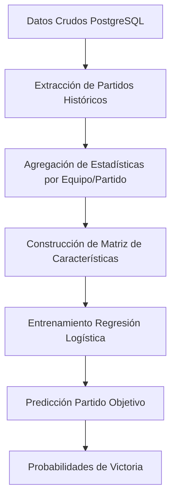

# whowins - Predictor de Partidos NBA

Un script en R que utiliza regresión logística binaria para predecir el resultado de partidos de baloncesto de la NBA basándose en estadísticas históricas de jugadores.

## Índice
- [Descripción Técnica](#descripción-técnica)
- [Fundamentos Estadísticos](#fundamentos-estadísticos)
- [Arquitectura del Modelo](#arquitectura-del-modelo)
- [Instalación](#instalación)
- [Configuración](#configuración)
- [Uso](#uso)
- [Estructura de la Base de Datos](#estructura-de-la-base-de-datos)
- [Metodología](#metodología)
- [Limitaciones](#limitaciones)

## Descripción Técnica

Este proyecto implementa un modelo de aprendizaje automático supervisado para la predicción binaria de resultados deportivos. El sistema utiliza **regresión logística** para estimar la probabilidad de victoria del equipo local en un enfrentamiento entre dos equipos de la NBA.

### Características principales:
- **Modelo**: Regresión logística binaria
- **Variables predictoras**: Estadísticas agregadas de jugadores (puntos, asistencias, rebotes, PIE)
- **Variable respuesta**: Victoria/derrota del equipo local (1/0)
- **Datos**: Estadísticas históricas de jugadores y partidos almacenadas en PostgreSQL

## Fundamentos Estadísticos

### Regresión Logística Binaria

La regresión logística es una técnica de modelado estadístico que utiliza la función logística (sigmoide) para modelar la probabilidad de que ocurra un evento binario. En nuestro caso:

```
P(Y = 1|X) = 1 / (1 + e^(-β₀ - β₁X₁ - β₂X₂ - ... - βₖXₖ))
```

Donde:
- **Y**: Variable dependiente binaria (1 = victoria equipo local, 0 = derrota)
- **X₁, X₂, ..., Xₖ**: Variables independientes (estadísticas de los equipos)
- **β₀, β₁, ..., βₖ**: Coeficientes del modelo estimados mediante máxima verosimilitud

### Variables del Modelo

#### Variables Predictoras (Features):
1. **home_avg_pts**: Promedio de puntos del equipo local
2. **home_avg_ast**: Promedio de asistencias del equipo local  
3. **home_avg_reb**: Promedio de rebotes del equipo local
4. **away_avg_pts**: Promedio de puntos del equipo visitante
5. **away_avg_ast**: Promedio de asistencias del equipo visitante
6. **away_avg_reb**: Promedio de rebotes del equipo visitante

#### Variable PIE (Player Impact Estimate)
Se calcula también la estadística **PIE**, una métrica avanzada que estima el impacto general de un jugador:
```
PIE = (PTS + FGM + FTM - FGA - FTA + DREB + 0.5*OREB + AST + STL + 0.5*BLK - PF - TO) / (GmPTS + GmFGM + GmFTM - GmFGA - GmFTA + GmDREB + 0.5*GmOREB + GmAST + GmSTL + 0.5*GmBLK - GmPF - GmTO)
```

### Función de Enlace y Transformación

La regresión logística utiliza la función **logit** como función de enlace:
```
logit(p) = log(p/(1-p)) = β₀ + β₁X₁ + ... + βₖXₖ
```

Esta transformación permite mapear probabilidades (0,1) al rango completo de números reales (-∞,+∞).

## Arquitectura del Modelo

### Pipeline de Procesamiento



### Proceso de Agregación

Para cada partido histórico, el sistema:

1. **Identifica jugadores activos**: Excluye jugadores listados como inactivos usando `Game_Inactive_Players`
2. **Calcula promedios por equipo**: Agrega estadísticas individuales a nivel de equipo
3. **Maneja valores faltantes**: Reemplaza NAs con 0 para mantener consistencia
4. **Construye características**: Combina estadísticas locales y visitantes en un vector de características

### Fórmula del Modelo

```r
outcome ~ home_avg_pts + home_avg_ast + home_avg_reb + away_avg_pts + away_avg_ast + away_avg_reb
```

## Instalación

### Prerrequisitos

- **R** (versión 4.0 o superior)
- **PostgreSQL** con datos de NBA
- **Sistema operativo**: Linux/macOS (recomendado) o Windows con WSL

### Paquetes de R Requeridos

```r
install.packages(c("DBI", "RPostgres", "dplyr", "dotenv"))
```

### Instalación del Script

```bash
# Clonar o descargar el script
chmod +x whowins

# Verificar que Rscript esté disponible
which Rscript
```

## Configuración

### Archivo .env

Crear un archivo `.env` en el mismo directorio que el script:

```bash
# Configuración de PostgreSQL
PGHOST=localhost
PGPORT=5432
PGUSER=tu_usuario
PGPASSWORD=tu_contraseña
PGDATABASE=tu_base_datos_nba
```

**⚠️ Importante**: Nunca commitear el archivo `.env` al repositorio. Agregar a `.gitignore`.

### Variables de Entorno

El script puede usar variables del sistema si no existe `.env`:

```bash
export PGHOST=localhost
export PGUSER=usuario
export PGPASSWORD=contraseña
export PGDATABASE=nba_db
```

## Uso

### Sintaxis Básica

```bash
./whowins <EQUIPO_LOCAL> <EQUIPO_VISITANTE>
```

### Ejemplos

```bash
# Lakers vs Celtics
./whowins LAL BOS

# Warriors vs Heat  
./whowins GSW MIA

# Nets vs Knicks
./whowins BKN NYK
```

### Salida del Programa

```
Environment file loaded from: /path/to/.env
Connected to PostgreSQL database: nba_stats
Processing 1247 games to train the model...
  Processed 1247 / 1247 games (100.0%)
Training logistic regression model...
Getting current team statistics...

============================================================
PREDICTION: LAL is the probable winner
Probability: LAL 67.3% vs BOS 32.7%
============================================================
Prediction completed
```

## Estructura de la Base de Datos

### Tablas Requeridas

#### Game
Contiene información de partidos:
```sql
- GAME_ID (clave primaria)
- TEAM_ABBREVIATION_HOME (varchar)
- TEAM_ABBREVIATION_AWAY (varchar)  
- WL_HOME (varchar: 'W'/'L')
- GAME_DATE_EST (date)
- PTS_HOME, PTS_AWAY (numeric)
```

#### Player_Attributes  
Estadísticas de jugadores por partido:
```sql
- GAME_ID (foreign key)
- TEAM_ABBREVIATION (varchar)
- TEAM_NAME (varchar)
- FIRST_NAME, LAST_NAME (varchar)
- PTS, AST, REB, PIE (numeric)
```

#### Game_Inactive_Players
Jugadores inactivos por partido:
```sql
- GAME_ID (foreign key)
- TEAM_ABBREVIATION (varchar)
- TEAM_NAME (varchar)
- FIRST_NAME, LAST_NAME (varchar)
```

### Consultas SQL Internas

#### Agregación de Estadísticas
```sql
SELECT
  AVG(CAST(pa.PTS AS DOUBLE PRECISION)) AS avg_pts,
  AVG(CAST(pa.AST AS DOUBLE PRECISION)) AS avg_ast,
  AVG(CAST(pa.REB AS DOUBLE PRECISION)) AS avg_reb,
  AVG(CAST(pa.PIE AS DOUBLE PRECISION)) AS avg_pie
FROM Player_Attributes pa
WHERE pa.TEAM_ABBREVIATION = $1
  AND NOT EXISTS (SELECT 1 FROM Game_Inactive_Players gip ...)
```

## Metodología

### Preprocesamiento de Datos

1. **Limpieza**: Exclusión de partidos con datos faltantes en equipos
2. **Filtrado**: Remoción de jugadores inactivos mediante coincidencia de nombres
3. **Agregación**: Cálculo de promedios por equipo y partido
4. **Imputación**: Reemplazo de valores NA con 0

### Entrenamiento del Modelo

1. **División de datos**: Todo el dataset histórico como entrenamiento
2. **Función de costo**: Log-verosimilitud (máxima verosimilitud)
3. **Algoritmo de optimización**: IRLS (Iteratively Reweighted Least Squares)
4. **Familia de distribución**: Binomial con enlace logit

### Validación

El modelo utiliza **toda la información histórica** disponible para hacer predicciones. No implementa validación cruzada en la versión actual.

### Interpretación de Coeficientes

Los coeficientes β representan el cambio en el log-odds por unidad de cambio en la variable predictora:
- **Coeficiente positivo**: Incrementa probabilidad de victoria local
- **Coeficiente negativo**: Reduce probabilidad de victoria local
- **Magnitud**: Indica fuerza de la asociación


### Argumentos disponibles (Abbreviation names)

**Query:**

```
SELECT DISTINCT 
  TEAM_ABBREVIATION_HOME AS team_abbr,
  TEAM_NAME_HOME AS team_name
FROM Game 
WHERE TEAM_ABBREVIATION_HOME IS NOT NULL 
  AND TEAM_NAME_HOME IS NOT NULL
UNION
SELECT DISTINCT 
  TEAM_ABBREVIATION_AWAY AS team_abbr,
  TEAM_NAME_AWAY AS team_name
FROM Game 
WHERE TEAM_ABBREVIATION_AWAY IS NOT NULL 
  AND TEAM_NAME_AWAY IS NOT NULL
ORDER BY team_abbr;
```

**Respuesta**

```
MIH       | Milwaukee Hawks
 MIL       | Milwaukee Bucks
 MIN       | Minnesota Timberwolves
 MNL       | Minneapolis Lakers
 NJN       | New Jersey Nets
 NOH       | New Orleans Hornets
 NOJ       | New Orleans Jazz
 NOK       | New Orleans/Oklahoma City Hornets
 NOP       | New Orleans Pelicans
 NYK       | New York Knicks
 NYN       | New York Nets
 OKC       | Oklahoma City Thunder
 ORL       | Orlando Magic
 PHI       | Philadelphia 76ers
 PHL       | Philadelphia 76ers
 PHW       | Philadelphia Warriors
 PHX       | Phoenix Suns
 PIT       | Pittsburgh Ironmen
 POR       | Portland Trail Blazers
 PRO       | Providence Steamrollers
 ROC       | Rochester Royals
 SAC       | Sacramento Kings
 SAN       | San Antonio Spurs
 SAS       | San Antonio Spurs
 SDC       | San Diego Clippers
 SDR       | San Diego Rockets
 SEA       | Seattle SuperSonics
 SFW       | San Francisco Warriors
 SHE       | Sheboygan Redskins
 STL       | St. Louis Hawks
 SYR       | Syracuse Nationals
 TCB       | Tri-Cities Blackhawks
 TOR       | Toronto Raptors
 UTA       | Utah Jazz
 UTH       | Utah Jazz
 VAN       | Vancouver Grizzlies
 WAS       | Washington Bullets
 WAS       | Washington Capitols
 WAS       | Washington Wizards
 WAT       | Waterloo Hawks
(79 rows)
```
